<div align="center">

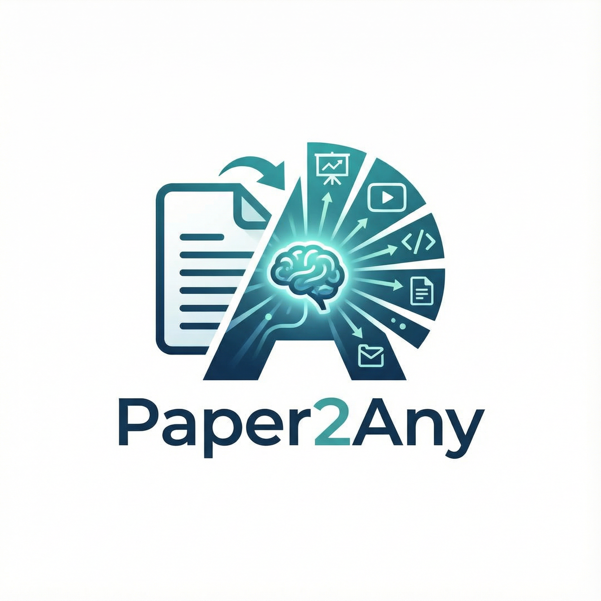

# Paper2Any

[](https://www.python.org/)
[](LICENSE)
[](https://github.com/OpenDCAI/Paper2Any)
[](https://github.com/OpenDCAI/Paper2Any/stargazers)

中文 | [English](README_EN.md)

✨ **专注论文多模态工作流：从论文 PDF/截图/文本，一键生成模型示意图、技术路线图、实验图和演示文稿** ✨

| 📄 **Universal File Support** &nbsp;|&nbsp; 🎯 **AI-Powered Generation** &nbsp;|&nbsp; 🎨 **Custom Styling** &nbsp;|&nbsp; ⚡ **Lightning Speed** |

<br>

<a href="#-快速开始" target="_self">
  
</a>
<a href="http://dcai-paper2any.nas.cpolar.cn/" target="_blank">
  
</a>
<a href="docs/" target="_blank">
  
</a>
<a href="docs/contributing.md" target="_blank">
  
</a>

<br>
<br>

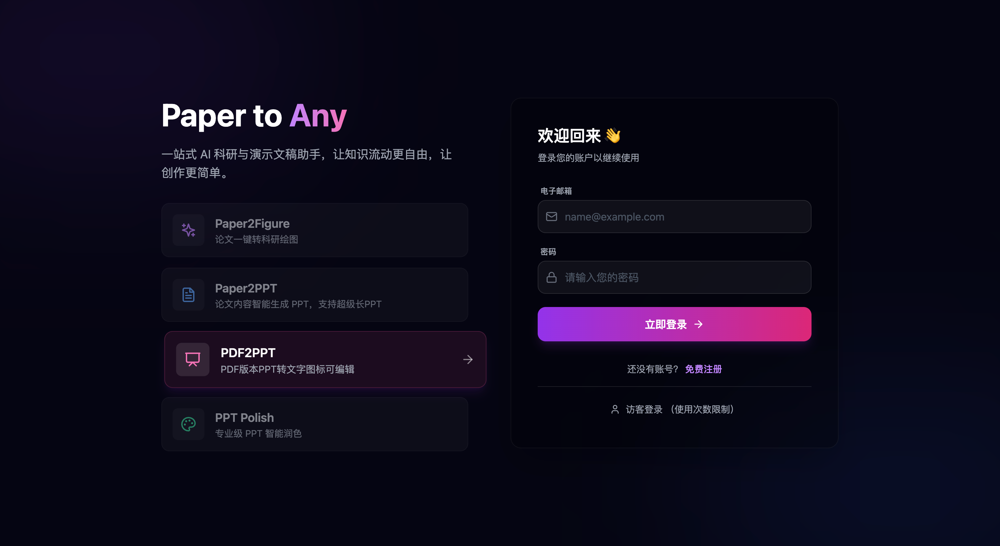

</div>

---

## 📢 Roadmap & 拆分公告

> [!IMPORTANT]
> **本项目正在进行架构拆分，以提供更专注的功能体验。**

- **[Paper2Any](https://github.com/OpenDCAI/Paper2Any)** (本仓库)：
  - 专注于论文多模态工作流（Paper2Figure, Paper2PPT, Paper2Video 等）。
  - 为科研人员提供一键式绘图、PPT 生成和视频脚本辅助工具。

- **[DataFlow-Agent](https://github.com/OpenDCAI/DataFlow-Agent)** (新仓库)：
  - 专注于 DataFlow 算子编排和编写。
  - 提供通用的多智能体数据流处理框架和算子开发工具。

---

## 📑 目录

- [🔥 News](#-news)
- [✨ 核心功能](#-核心功能)
- [📸 功能展示](#-功能展示)
- [🚀 快速开始](#-快速开始)
- [📂 项目结构](#-项目结构)
- [🗺️ 开发计划](#️-开发计划)
- [🤝 贡献](#-贡献)

---

## 🔥 News

> [!TIP]
> 🆕 <strong>2025-12-12 · Paper2Figure 网页端公测上线</strong><br>
> 支持一键生成多种<strong>可编辑</strong>科研绘图（模型架构图 / 技术路线图 / 实验数据图）<br>
> 🌐 在线体验：<a href="http://dcai-paper2any.nas.cpolar.cn/">http://dcai-paper2any.nas.cpolar.cn/</a>

- 2025-10-01 · 发布 <code>0.1.0</code> 首个版本

---

## ✨ 核心功能

> 从论文 PDF / 图片 / 文本出发，一键生成**可编辑**的科研绘图、演示文稿、视频脚本、学术海报等多模态内容。

Paper2Any 当前包含以下几个子能力：

- **📊 Paper2Figure - 可编辑科研绘图**：一键生成模型架构图、技术路线图（PPT + SVG）、实验数据图，支持多种输入源，输出可编辑 PPTX。
- **🎬 Paper2PPT - 可编辑演示文稿**：生成任意风格PPT，支持超长文档处理，内置表格提取与图表解析功能。
- **🖼️ PDF2PPT - 版式保留转换**：智能抠图与版式分析，将 PDF 精准转换为可编辑 PPTX。
- **🎨 PPT 智能美化**：基于 AI 的 PPT 排版优化与风格迁移。

---

## 📸 功能展示

### 📊 Paper2Figure: 科研绘图生成

<div align="center">

<br>
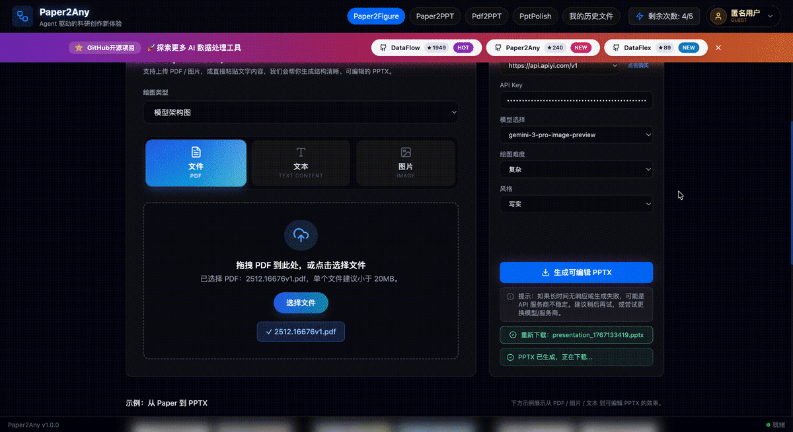
<br><sub>✨ 模型架构图生成</sub>

<br>
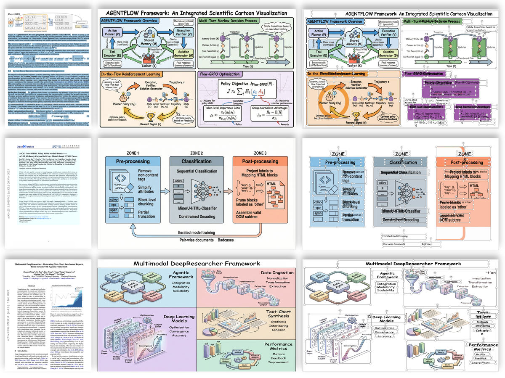
<br><sub>✨ 模型架构图生成</sub>

<br><br>
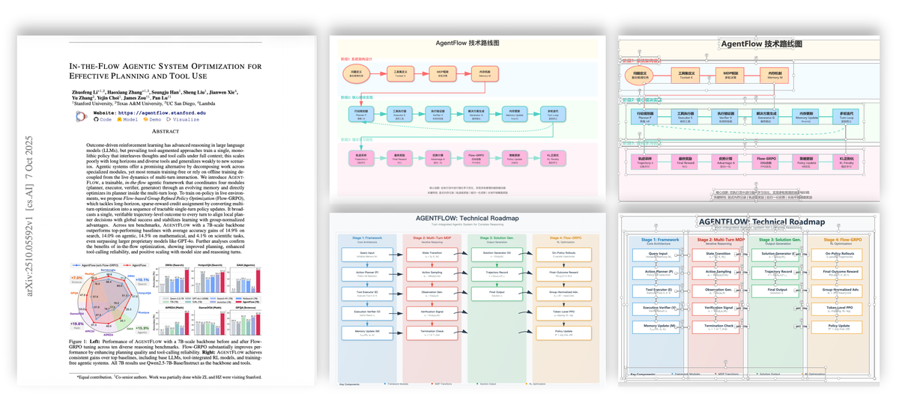
<br><sub>✨ 技术路线图生成</sub>

<br><br>
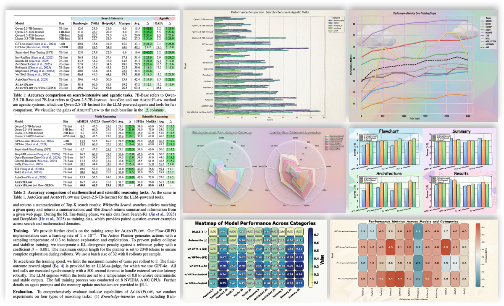
<br><sub>✨ 实验数据图生成 (多种风格)</sub>

</div>

---

### 🎬 Paper2PPT: 论文转演示文稿

<div align="center">

<br>
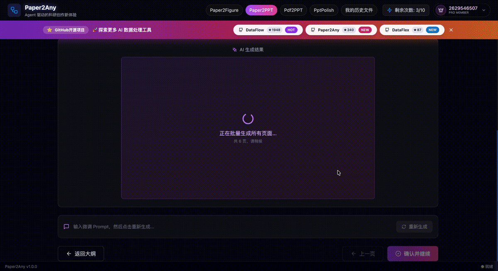
<br><sub>✨ PPT生成案例</sub>

<br>
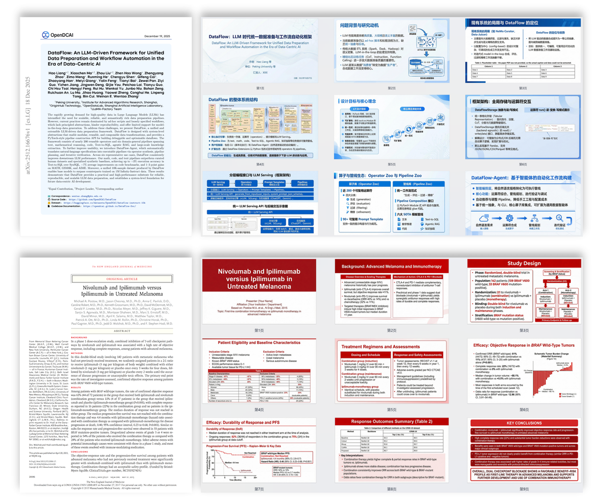
<br><sub>✨ Paper / Text / Topic → PPT</sub>

<br><br>
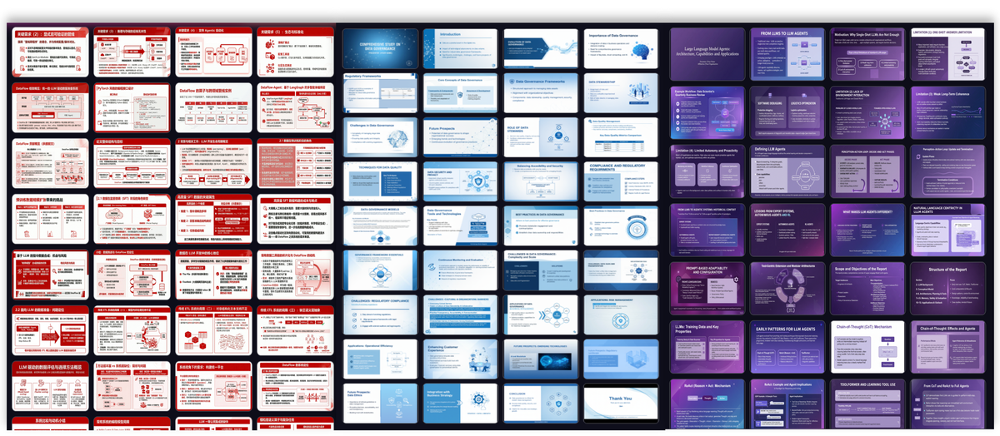
<br><sub>✨ 超长文档支持 (40+ 页 PPT)</sub>

<br><br>
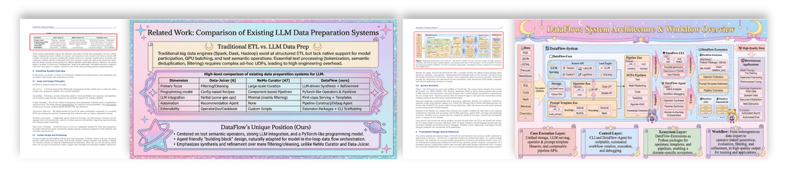
<br><sub>✨ 智能表格提取与插入</sub>

</div>

---

### 🎨 PPT 智能美化

<div align="center">

<br>
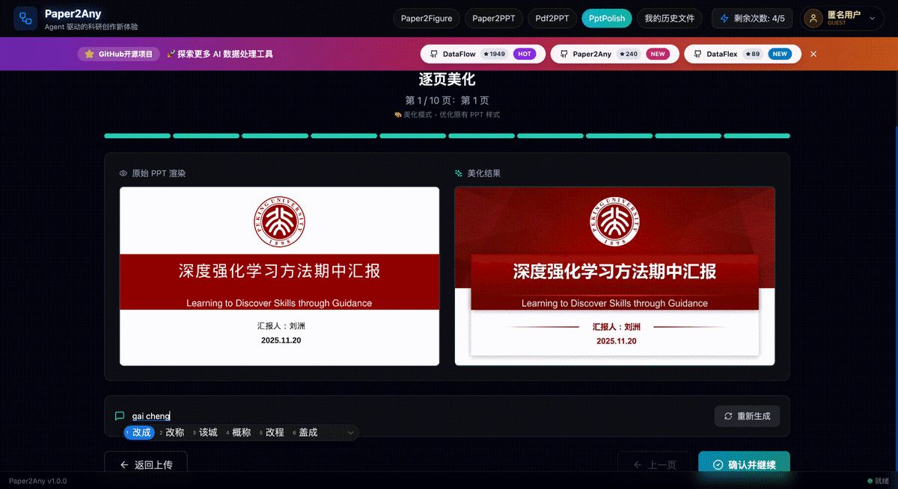
<br><sub>✨ 基于 AI 的排版优化</sub>

<br>
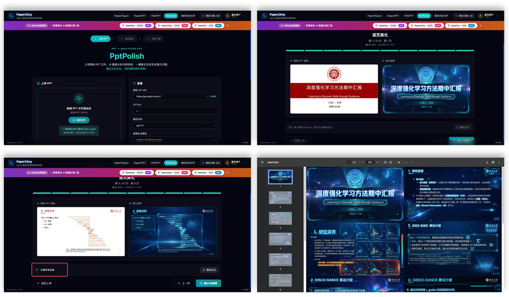
<br><sub>✨ 基于 AI 的排版优化与风格迁移</sub>

</div>

---

### 🖼️ PDF2PPT: 版式保留转换

<div align="center">

<br>
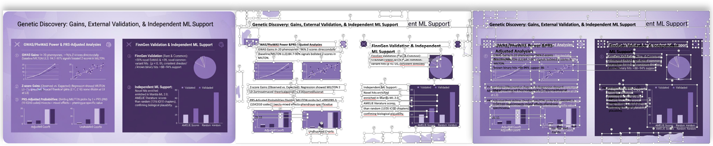
<br><sub>✨ 智能抠图 & 版式保留</sub>

</div>

---

## 🚀 快速开始

### 环境要求


### 🐧 Linux 安装

> 建议使用 Conda 创建隔离环境（推荐 Python 3.11）。  

#### 1. 创建环境并安装基础依赖

```bash
# 0. 创建并激活 conda 环境
conda create -n paper2any python=3.11 -y
conda activate paper2any

# 1. 克隆仓库
git clone https://github.com/OpenDCAI/Paper2Any.git
cd Paper2Any

# 2. 安装基础依赖
pip install -r requirements-base.txt

# 3. 开发模式安装
pip install -e .
```

#### 2. 安装 Paper2Any 相关依赖（必须）

Paper2Any 涉及 LaTeX 渲染、矢量图处理以及 PPT/PDF 转换，需要额外依赖：

```bash
# 1. Python 依赖
pip install -r requirements-paper.txt || pip install -r requirements-paper-backup.txt

# 2. LaTeX 引擎 (tectonic) - 推荐用 conda 安装
conda install -c conda-forge tectonic -y

# 3. 解决 doclayout_yolo 依赖冲突（重要）
pip install doclayout_yolo --no-deps

# 4. 系统依赖 (Ubuntu 示例)
sudo apt-get update
sudo apt-get install -y inkscape libreoffice poppler-utils wkhtmltopdf
```

#### 3. 配置环境变量

```bash
export DF_API_KEY=your_api_key_here
export DF_API_URL=xxx  # 可选：如需使用第三方 API 中转站
export MINERU_DEVICES="0,1,2,3" # 可选：MinerU 任务 GPU 资源池
```

#### 4. 配置 Supabase (前后端必需)

在 `frontend-workflow` 目录下创建 `.env` 文件并填入以下配置：

```bash
# frontend-workflow/.env

VITE_SUPABASE_URL=your_supabase_url
VITE_SUPABASE_ANON_KEY=your_supabase_anon_key

# Backend
SUPABASE_URL=your_supabase_url
SUPABASE_ANON_KEY=your_supabase_anon_key
SUPABASE_SERVICE_ROLE_KEY=your_service_role_key
SUPABASE_JWT_SECRET=your_jwt_secret

# Application Settings
DAILY_WORKFLOW_LIMIT=10
```

<details>
<summary><strong>高级配置：本地模型服务负载均衡</strong></summary>

如果是本地部署高并发环境，可以使用 `script/start_model_servers.sh` 启动本地模型服务集群（MinerU / SAM / OCR）。

脚本位置：`/DataFlow-Agent/script/start_model_servers.sh`

**主要配置项说明：**

- **MinerU (PDF 解析)**
  - `MINERU_MODEL_PATH`: 模型路径 (默认 `models/MinerU2.5-2509-1.2B`)
  - `MINERU_GPU_UTIL`: 显存占用比例 (默认 0.2)
  - **实例配置**: 脚本默认在 GPU 0 和 GPU 4 上各启动 4 个实例 (共 8 个)，端口范围 8011-8018。
  - **Load Balancer**: 端口 8010，自动分发请求。

- **SAM (Segment Anything Model)**
  - **实例配置**: 默认在 GPU 2 和 GPU 3 上各启动 1 个实例，端口 8021-8022。
  - **Load Balancer**: 端口 8020。

- **OCR (PaddleOCR)**
  - **配置**: 运行在 CPU 上，使用 uvicorn 的 worker 机制 (默认 4 workers)。
  - **端口**: 8003。

> 使用前请根据实际 GPU 数量和显存情况修改脚本中的 `gpu_id` 和实例数量。

</details>

---

### 🪟 Windows 安装

> [!NOTE]
> 目前推荐优先在 Linux / WSL 环境下体验 Paper2Any。 若你需要在 原生 Windows 上部署，请按以下步骤操作。

#### 1. 创建环境并安装基础依赖

```bash
# 0. 创建并激活 conda 环境
conda create -n paper2any python=3.12 -y
conda activate paper2any

# 1. 克隆仓库
git clone https://github.com/OpenDCAI/Paper2Any.git
cd Paper2Any

# 2. 安装基础依赖
pip install -r requirements-win-base.txt

# 3. 开发模式安装
pip install -e .
```

#### 2. 安装 Paper2Any 相关依赖（推荐）

Paper2Any 涉及 LaTeX 渲染与矢量图处理，需要额外依赖（见 requirements-paper.txt）：

```bash
# Python 依赖
pip install -r requirements-paper.txt

# tectonic：LaTeX 引擎（推荐用 conda 安装）
conda install -c conda-forge tectonic -y
```

**🎨 安装 Inkscape（SVG/矢量图处理｜推荐/必装）**

1. 下载并安装（Windows 64-bit MSI）：[Inkscape Download](https://inkscape.org/release/inkscape-1.4.2/windows/64-bit/msi/?redirected=1)
2. 将 Inkscape 可执行文件目录加入系统环境变量 Path（示例）：`C:\Program Files\Inkscape\bin\`

> [!TIP]
> 配置 Path 后建议重新打开终端（或重启 VS Code / PowerShell），确保环境变量生效。

#### ⚡ 安装 Windows 编译版 vLLM（可选｜用于本地推理加速）

发布页参考：[vllm-windows releases](https://github.com/SystemPanic/vllm-windows/releases)
推荐版本：0.11.0

```bash
pip install vllm-0.11.0+cu124-cp312-cp312-win_amd64.whl
```

> [!IMPORTANT]
> 请确保 `.whl` 与当前环境匹配：
> - Python：cp312（Python 3.12）
> - 平台：win_amd64
> - CUDA：cu124（需与你本机 CUDA/驱动适配）

#### 启动应用

**Paper2Any - 论文工作流 Web 前端（推荐）**

```bash
# 启动后端 API
cd fastapi_app
uvicorn main:app --host 0.0.0.0 --port 8000

# 启动前端（新终端）
cd frontend-workflow
npm install
npm run dev
```

**配置前端代理**

修改 `frontend-workflow/vite.config.ts` 中的 `server.proxy`：

```typescript
export default defineConfig({
  plugins: [react()],
  server: {
    port: 3000,
    open: true,
    allowedHosts: true,
    proxy: {
      '/api': {
        target: 'http://127.0.0.1:8000',  // FastAPI 后端地址
        changeOrigin: true,
      },
    },
  },
})
```
访问 `http://localhost:3000`

**Windows 加载 MinerU 预训练模型**

```powershell
# PowerShell环境下启动
vllm serve opendatalab/MinerU2.5-2509-1.2B `
  --host 127.0.0.1 `
  --port 8010 `
  --logits-processors mineru_vl_utils:MinerULogitsProcessor `
  --gpu-memory-utilization 0.6 `
  --trust-remote-code `
  --enforce-eager
```

> [!TIP]
> **Paper2Figure 网页端内测说明**
> 
> 当你部署了前端，还需要手动新建一个 `invite_codes.txt` 文件，并写入你的邀请码（例如：`ABCDEFG123456`）。
> 然后再启动后端。
> 
> 如果暂时不想部署前后端，可以先通过本地脚本体验 Paper2Any 的核心能力：
> - `python script/run_paper2figure.py`：模型架构图生成
> - `python script/run_paper2expfigure.py`：实验数据图生成
> - `python script/run_paper2technical.py`：技术路线图生成
> - `python script/run_paper2ppt.py`：论文内容生成可编辑 PPT
> - `python script/run_pdf2ppt_with_paddle_sam_mineru.py`：PDF2PPT（保留版式 + 可编辑内容）

---

### 启动应用

#### 🎨 Web 前端（推荐）

```bash
# 启动后端 API
cd fastapi_app
uvicorn main:app --host 0.0.0.0 --port 8000

# 启动前端（新终端）
cd frontend-workflow
npm install
npm run dev
```

访问 `http://localhost:3000`。

> [!TIP]
> 如果暂时不想部署前后端，可以通过本地脚本体验核心功能：
> - `python script/run_paper2figure.py`：模型架构图生成
> - `python script/run_paper2ppt.py`：论文生成 PPT
> - `python script/run_pdf2ppt_with_paddle_sam_mineru.py`：PDF 转 PPT

---

## 📂 项目结构

```
Paper2Any/
├── dataflow_agent/          # 核心代码库
│   ├── agentroles/         # Agent 定义
│   │   └── paper2any_agents/ # Paper2Any 专用 Agent
│   ├── workflow/           # Workflow 定义
│   ├── promptstemplates/   # Prompt 模板
│   └── toolkits/           # 工具集（绘图、PPT生成等）
├── fastapi_app/            # 后端 API 服务
├── frontend-workflow/      # 前端 Web 界面
├── static/                 # 静态资源
├── script/                 # 脚本工具
└── tests/                  # 测试用例
```

---

## 🗺️ 开发计划

<table>
<tr>
<th width="35%">功能</th>
<th width="15%">状态</th>
<th width="50%">子功能</th>
</tr>
<tr>
<td><strong>📊 Paper2Figure</strong><br><sub>可编辑科研绘图</sub></td>
<td></td>
<td>
<br>
<br>
<br>

</td>
</tr>
<tr>
<td><strong>🎬 Paper2PPT</strong><br><sub>可编辑演示文稿</sub></td>
<td></td>
<td>
<br>
<br>
<br>

</td>
</tr>
<tr>
<td><strong>🖼️ PDF2PPT</strong><br><sub>版式保留转换</sub></td>
<td></td>
<td>
<br>
<br>

</td>
</tr>
<tr>
<td><strong>🎨 PPT 美化</strong><br><sub>智能排版优化</sub></td>
<td></td>
<td>
<br>

</td>
</tr>
</table>

---

## 🤝 贡献

我们欢迎所有形式的贡献！

[](https://github.com/OpenDCAI/Paper2Any/issues)
[](https://github.com/OpenDCAI/Paper2Any/discussions)
[](https://github.com/OpenDCAI/Paper2Any/pulls)

---

## 📄 License

本项目采用 [Apache License 2.0](LICENSE) 开源协议。

<!-- --- -->

<!-- ## Star History

[](https://star-history.com/#OpenDCAI/Paper2Any&Date) -->

---

<div align="center">

**如果这个项目对你有帮助，请给我们一个 ⭐️ Star！**

[](https://github.com/OpenDCAI/Paper2Any/stargazers)
[](https://github.com/OpenDCAI/Paper2Any/network/members)

<br>


<br>
<sub>扫码加入社区微信群</sub>

<p align="center"> 
  <em> ❤️ Made with by OpenDCAI Team</em>
</p>

</div>
